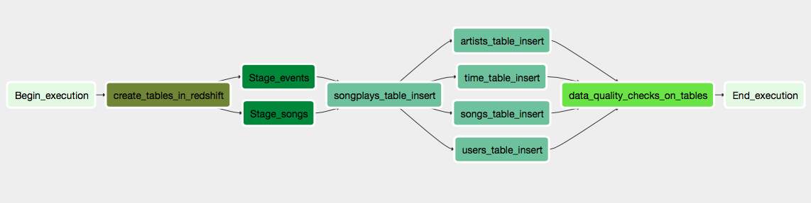

# Data Engineering Nanodegree - Data-Pipelines-Project

# Project Idea

Sparkify is the music straming app , they have their data residing on Amazon S3. It has JSON logs which has events ### genrated as a part of user activites on app and song metadata of the songs in their app.

## Project goals are,

Extracting the data from S3.
Staging the data on database residing on RedShift cluster.
Transoform data to dimensional and facts table.
These tables will then in turn used by analytics team in finding insights about songs users are listening to from their ### app and get the statistics about the usage.

# Project Description

In this project we are expected to build a ETL pipelines using Apache Airflow. 
In this project I have created  own custom operators to perform tasks such as staging the data, filling the data warehouse, and running checks on the data as the final step.

# Datasets
Udacity has provided two datasets

Log data: s3://udacity-dend/log_data
Song data: s3://udacity-dend/song_data

# Project Template
The project template package contains three major components for the project:

1. The dag template has all the imports and task templates in place, but the task dependencies have not been set
2. The operators folder with operator templates
3. A helper class for the SQL transformations

# Configuring the DAG

The DAG does not have dependencies on past runs
On failure, the task are retried 3 times
Retries happen every 5 minutes
Catchup is turned off
Do not email on retry
The task dependencies are configured so that after the dependencies are set, the graph view follows the flow shown in the image below.

# Operator 
## Stage Operator
The stage operator is expected to be able to load any JSON formatted files from S3 to Amazon Redshift. The operator creates and runs a SQL COPY statement based on the parameters provided. The operator's parameters should specify where in S3 the file is loaded and what is the target table.

The parameters should be used to distinguish between JSON file. Another important requirement of the stage operator is containing a templated field that allows it to load timestamped files from S3 based on the execution time and run backfills.

## Fact and Dimension Operators
With dimension and fact operators, you can utilize the provided SQL helper class to run data transformations. Most of the logic is within the SQL transformations and the operator is expected to take as input a SQL statement and target database on which to run the query against. You can also define a target table that will contain the results of the transformation.

Dimension loads are often done with the truncate-insert pattern where the target table is emptied before the load. Thus, you could also have a parameter that allows switching between insert modes when loading dimensions. Fact tables are usually so massive that they should only allow append type functionality.

## Data Quality Operator
The final operator to create is the data quality operator, which is used to run checks on the data itself. The operator's main functionality is to receive one or more SQL based test cases along with the expected results and execute the tests. For each the test, the test result and expected result needs to be checked and if there is no match, the operator should raise an exception and the task should retry and fail eventually.
